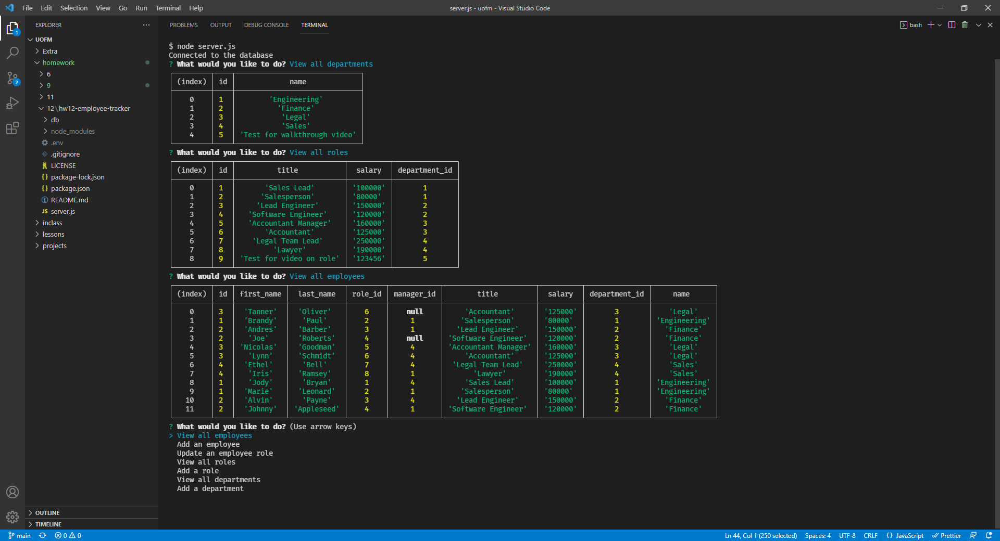

# hw12 Employee Tracker

## Description

In this application I built a employee tracker run from the console. To start the process you would type node server.js and you'll be promted with the choices you can make. You can track employees, roles and departments in the app. When you click that you wanna view a specific option it will show a table in the console of all the information avaiable to that choice. You can also add employee's, role's and department's as you please.

## Table of Contents

- [Installation](#installation)
- [Usage](#usage)
- [License](#license)
- [Contribution](#contribution)
- [Test](#test)
- [Questions](#questions)

## Installation

When you get this you should be able to just run npm install and it will install all you need. Otherwise you will need to install mysql2, dotenv, console.table and inquirer.

## Usage

You can use the application in the console by typing in node server.js. Select through the list of prompts what you would like to add or view, then you will either be prompted more or shown a table in the console.

## License

This project is under the MIT license.

## Contribution

inquirer, dotenv, mysql2 and console.table were the packages used.

## Test

You can test the application by running the app in the console and making a team yourself.

## Questions

My GitHub is: [TannerOliver](https://github.com/TannerOliver)
You can reach me at Email: 435.tanner@gmail.com

Go Check out this walkthrough-video on how to use this app! [Video](https://drive.google.com/file/d/1VAyVatusnwa-0Fk6gkIALZPo70Pjk8X2/view?usp=sharing)
